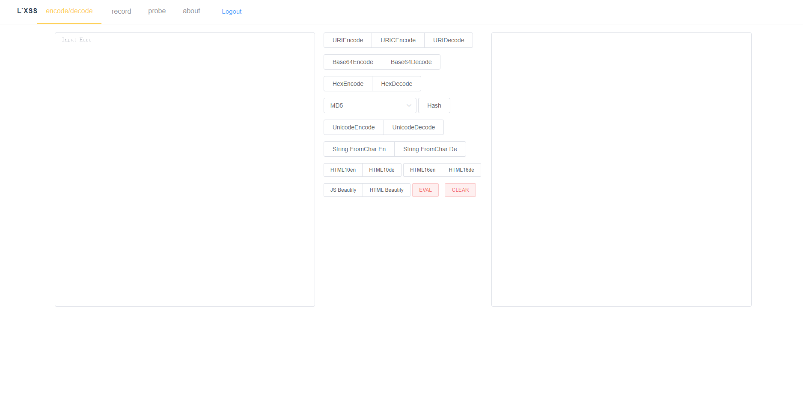
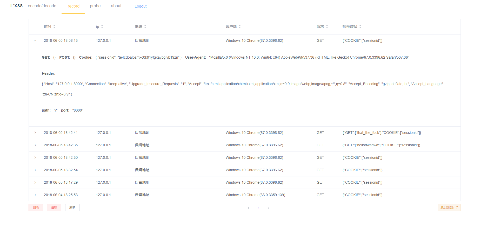
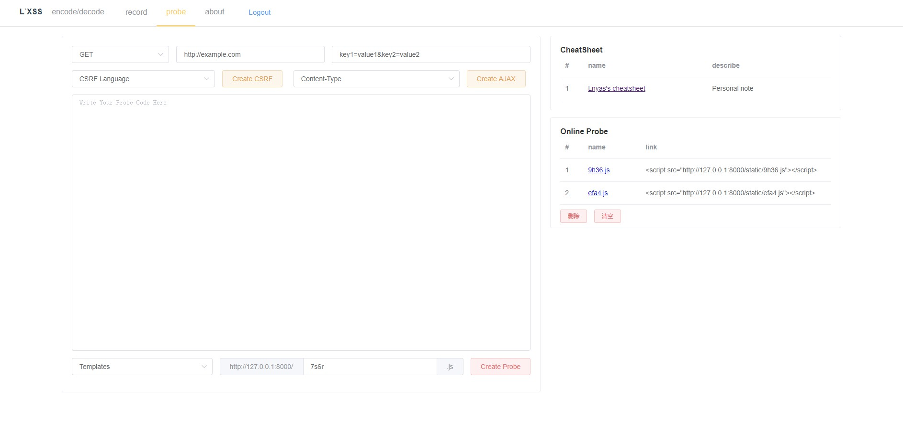

# L`XSS

功能性 XSS 平台

参考了蓝莲花的 XSS 平台和余弦的 xssor 以及 ph 师傅的 playground

### 安装和部署

需要 Python3 和 Django

```
git clone https://github.com/zxyxx/L-XSS.git lxss
cd lxss
chmod +x install.sh & chmod +x start.sh
```

如果直接用 Python 启动：

```
python3 manage.py runserver 0.0.0.0:8000
```

如果用 Nginx 反代理：

首先需要配置 Nginx，让其代理static文件和本地启动的 Django，给出一个示例配置文件：

```
server {
    listen 80;
    #listen [::]:80;
    server_name xss.example.com;
    location ^~ /static {
        alias /var/www/xss.example.com/lxss/frontend/dist/static;
    }

    location / {
        proxy_pass http://127.0.0.1:8000;
        proxy_pass_header       Authorization;
        proxy_pass_header       WWW-Authenticate;
        proxy_set_header Host $host;
        proxy_set_header Cookie $http_cookie;
        proxy_set_header X-Forwarded-For $remote_addr;
    }
}
```

然后用start.sh启动：

```
./start.sh
```

### 功能

XSS 接收平台 + XSS probe 控制台 + XSS payload 生成和编码

#### encode/decode

用来进行各种类型的编码解码和美化

#### record

XSS 接收平台

#### probe

XSS 探针生成，XSS模板，Cheatsheet

模板存储在 `backend/static/templates/` cheatsheet文件存储在 `backend/static/templates/`，增加模板不需要修改源码，增加 cheatsheet 需要修改 `frontends/src/components/Probe.vue`里的`cheatsheetData`，如果用 Nginx 反代理静态文件，要把 backend 的 static 文件夹里的东西复制到frontend/dist/static 里去，因为我还不知道如何让 Nginx 设置两个 static 路径 ._.

### 界面

#### login


#### encode/decode



#### record



#### probe



### 其他

开发笔记可以看我博客